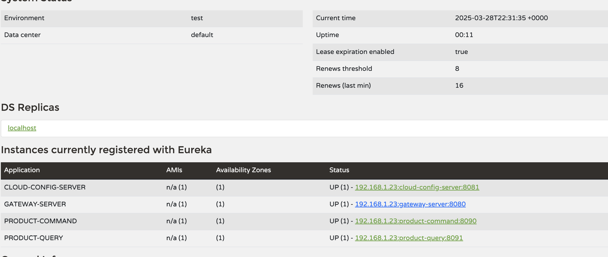

# spring-axon-rabbitmq-starter

This project is a **Spring Boot** application using **Axon Framework**, **RabbitMQ**, and **PostgreSQL**, following *
*DDD** (Domain-Driven Design) and **CQRS** (Command Query Responsibility Segregation) principles.

And postgres as event store

## 📥 Run the Project

```sh
git clone https://github.com/coundia/spring-microservices-starter.git


```

## 📌 Prerequisites

Before running the application, make sure you have installed:

https://taskfile.dev/installation/

- [Docker](https://www.docker.com/)
- [Docker Compose](https://docs.docker.com/compose/)
- [Maven](https://maven.apache.org/)

## 🚀 Installation and Execution

### 1️⃣ Start PostgreSQL and RabbitMQ

Run the following command to start the Docker containers:

```sh
docker compose -f docker/main.yml up -d
```
 

### 3️⃣ Start the Spring Boot Application

```sh
task start
```
or

```sh
cd cloud-config-server && mvn spring-boot:run > ../cloud-config-server.log 2>&1 &
cd eureka && mvn spring-boot:run > ../eureka.log 2>&1 &
cd gateway-server && mvn spring-boot:run > ../gateway-server.log 2>&1 &
cd products-command && mvn spring-boot:run > ../products-command.log 2>&1 &
cd products-query && mvn spring-boot:run > ../products-query.log 2>&1 &
```
 
## 📡 Eureka server

http://localhost:8761/ 



# See for example of  request
Or
Import in Postman
[microservices-starter.postman_collection.json](docs/microservices-starter.postman_collection.json)
# Request by Gateway

### throuth gateway
GET http://127.0.0.1:8080/api/v1/queries/products
###
POST http://127.0.0.1:8080/api/v1/commands/products
Content-Type: application/json

{
"price": 999,
"name": "Product 1"
}
##
[resquest.http](docs/resquest.http)

## 📁 Project Structure

```
├── Dockerfile
├── README.md
├── Taskfile.yml
├── cloud-config-server
├── cloud-config-server.log
├── config-repo
├── docker
├── docs
├── eureka
├── eureka.log
├── gateway-server
├── gateway-server.log
├── kill.ports.sh
├── pom.xml
├── products-command
├── products-command.log
├── products-query
├── products-query.log
└── selenium


```

# stop server

``` sh
task stop 

#or

sh kill.ports.sh 8761 8080 8081 8090 8091
```

## 🔹 Notes

- The application follows the **CQRS pattern**, separating command and query models.
- **RabbitMQ** is used as a **message broker** for event-driven communication.
- **PostgreSQL** is the primary database.

## 📜 License

CC-BY-NC-SA-4.0
