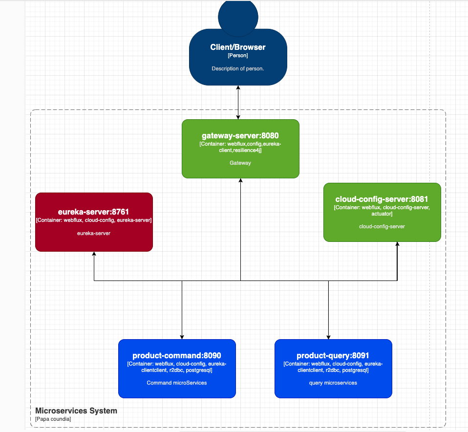

# Spring Axon RabbitMQ Webflux Postgres(EventStore and Db) Starter

This project is a maven module project with
**Spring Boot** application that leverages **Axon Framework**,
**RabbitMQ**, and **PostgreSQL**. It is built following **Domain-Driven Design (DDD)** and **Command Query Responsibility Segregation (CQRS)** principles, with PostgreSQL serving as the event store.

---

## Table of Contents

- [Overview](#overview)
- [Prerequisites](#prerequisites)
- [Installation and Execution](#installation-and-execution)
	- [1. Clone the Repository](#1-clone-the-repository)
	- [2. Start PostgreSQL and RabbitMQ](#2-start-postgresql-and-rabbitmq)
	- [3. Start the Spring Boot Applications](#3-start-the-spring-boot-applications)
- [Eureka Server](#eureka-server)
- [API Requests via Gateway](#api-requests-via-gateway)
- [Project Structure](#project-structure)
- [Stopping the Servers](#stopping-the-servers)
- [Notes](#notes)
- [License](#license)

---

## Overview

The **Spring Axon RabbitMQ Starter** project demonstrates a microservices architecture by combining:

- **Axon Framework** for CQRS and Event Sourcing
- **RabbitMQ** for event-driven messaging
- **PostgreSQL** as both the primary database and the event store
- **Eureka** for service discovery
- **Spring Cloud Config Server** for centralized configuration
- **Spring Cloud Gateway** for API routing

---

# Architecture

- See

[architecture.md](docs/architecture.md)



Image created by draw.io

[docker.md](docs/docker.md)


## Prerequisites

Before running the application, ensure you have installed:

- [Docker](https://www.docker.com/)
- [Docker Compose](https://docs.docker.com/compose/)
- [Maven](https://maven.apache.org/)
- [Taskfile](https://taskfile.dev/installation/)

---

## Installation and Execution

### 1. Clone the Repository

```sh
git clone https://github.com/coundia/spring-microservices-starter.git
```

### 2. Start PostgreSQL and RabbitMQ

Run the following command to start the Docker containers:

```sh
docker compose -f docker/main.yml up -d
```

### 3. Start the Spring Boot Applications

You can start all applications using the provided Taskfile:

```sh
task start
```

Alternatively, start each service manually:

```sh
cd cloud-config-server && mvn spring-boot:run > ../cloud-config-server.log 2>&1 &
cd eureka && mvn spring-boot:run > ../eureka.log 2>&1 &
cd gateway-server && mvn spring-boot:run > ../gateway-server.log 2>&1 &
cd products-command && mvn spring-boot:run > ../products-command.log 2>&1 &
cd products-query && mvn spring-boot:run > ../products-query.log 2>&1 &
```

---

## Eureka Server

The Eureka server dashboard is available at:  
[http://localhost:8761/](http://localhost:8761/)

Example dashboard:


---

## API Requests via Gateway

### Through Gateway

#### Query Products

- **Method:** GET
- **URL:** `http://127.0.0.1:8080/api/v1/queries/products`

#### Create a Product

- **Method:** POST
- **URL:** `http://127.0.0.1:8080/api/v1/commands/products`
- **Headers:** `Content-Type: application/json`
- **Body:**

  ```json
  {
    "price": 999,
    "name": "Product 1"
  }
  ```

You can also import the provided Postman collection:  
[microservices-starter.postman_collection.json](docs/microservices-starter.postman_collection.json)

For example HTTP requests, see the [resquest.http](docs/resquest.http) file.

---

## Project Structure

```
.
├── Dockerfile
├── README.md
├── Taskfile.yml
├── cloud-config-server
├── cloud-config-server.log
├── config-repo
├── docker
├── docs
├── eureka
├── eureka.log
├── gateway-server
├── gateway-server.log
├── kill.ports.sh
├── pom.xml
├── products-command
├── products-command.log
├── products-query
├── products-query.log
└── selenium
```

---

## Stopping the Servers

To stop all running services, use:

```sh
task stop
```

Or run the script with the relevant ports:

```sh
sh kill.ports.sh 8761 8080 8081 8090 8091
```

---

## Notes

- The application implements the **CQRS pattern**, separating command and query responsibilities.
- **RabbitMQ** is used as the messaging broker for event-driven communication.
- **PostgreSQL** is the primary database and serves as the event store.
- Ensure version compatibility between Spring Boot, Spring Cloud, and Axon Framework.
- Check your configuration files in the `config-repo` to ensure that each microservice (e.g., `gateway-server.properties`) is correctly defined.

---

## License

This project is licensed under the **CC-BY-NC-SA-4.0** license.

